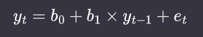
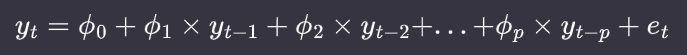
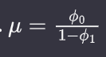
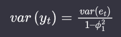
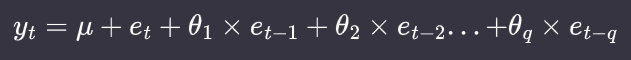

# Statistical Models for Time Series

## Introduction

In this chapter, we study some linear statistical models for time series. These models are related to linear regression but account for the correlations that arise between data points in the same time series. The specific models we will discuss are:

* Autoregressive (AR) models, moving average (MA) models, and autoregressive integrated moving average (ARIMA) models

* Vector autoregression (VAR)

* Hierarchical models.

These models have traditionally been the workhorses of time series forecasting, and they continue to be applied in a wide range of situations, from academic research to industry modeling.

## Limitations of linear regression

A linear regression assumes you have independently and identically distributed (iid) data. In time series data, points near in time tend to be strongly correlated with one another. 

Ordinary least squares linear regression can be applied to time series data provided the following conditions hold:

* The time series has a linear response to its predictors.

* No input variable is constant over time or perfectly correlated with another input variable

* For each point in time, the expected value of the error, given all explanatory variables for all time periods is 0.

* The error at any given time period is uncorrelated with the inputs at any time period in the past or future. So a plot of the autocorrelation function of the errors will not indicate any pattern.

* Variance of the error is independent of time.

If these assumptions hold, then ordinary least squares regression is an unbiased estimator of the coefficients given the inputs, even for time series data.

## Autoregressive Models

The autoregressive (AR) model relies on the intuition that the past predicts the future and so posits a time series process in which the value at a point in time t is a function of the series’s values at earlier points in time.

Autoregression is a regression on past values to predict future values. The simplest AR model, an AR(1) model, describes a system as follows:



The generalization of this notation allows the present value of an AR process to depend on the p most recent values, producing an AR(p) process.

We now switch to more traditional notation, which uses ϕ to denote the autoregression coefficients:



An important condition to impose to the model is that if it stationary. __Weak stationarity__ requires only that the mean and variance of a process be time invariant.

__Strong stationarity__ requires that the distribution of the random variables output by a process remain the same over time.

When applying this condition to our model AR(1), we get (after some algebra that we skip):





### Choosing parameters for an AR(p) model

To assess the appropriateness of an AR model for your data, begin by plotting the process and its partial autocorrelation function (PACF).The PACF of an AR process should cut off to zero beyond the order p of an AR(p) process, giving a concrete and visual indication of the order of an AR process empirically seen in the data.

On the other hand, an AR process will not have an informative autocorrelation function (ACF), although it will have the characteristic shape of an ACF: exponential tapering with increasing time offset.

Let’s take a look at this with some actual data. We use some demand forecasting data published in the UCI Machine Learning Repository.

Let's start by importing all libraries we will need and preparing a directory to store the plots:

```python
import pandas as pd
import statsmodels.api as sm
import matplotlib.pyplot as plt
import numpy as np
import matplotlib
import pmdarima as pm
```

```python
from ast import Param
from random import seed
from sqlite3 import paramstyle
from numpy import disp
from pathlib import Path
from statsmodels.tsa.ar_model import AutoReg
from statsmodels.tsa.stattools import acf, pacf
from statsmodels.graphics.tsaplots import plot_acf, plot_pacf
from statsmodels.tsa.arima.model import ARIMA
from statsmodels.tsa.api import VAR
from pmdarima.arima import StepwiseContext
```

```python
plt.style.use("seaborn-darkgrid")
matplotlib.rcParams["axes.labelsize"] = 14
matplotlib.rcParams["xtick.labelsize"] = 12
matplotlib.rcParams["ytick.labelsize"] = 12
matplotlib.rcParams["text.color"] = "k"
matplotlib.rcParams["figure.dpi"] = 200
```

```python
directory = "plots"
Path(directory).mkdir(parents=True, exist_ok=True)
```

```python
out = "AIC: {0:0.3f}, HQIC: {1:0.3f}, BIC: {2:0.3f}"
```

```python
df = pd.read_csv(".lesson/assets/Daily_Demand_Forecasting_Orders.csv", sep=";")
df.rename(
    columns={
        df.columns[0]: "week",
        df.columns[8]: "traffic",
        df.columns[10]: "banking_orders_2",
        df.columns[11]: "banking_orders_3",
    },
    inplace=True,
)
```

First we plot the data in chronological order. Since we will model this as an AR process, we look to the PACF to set a cutoff on the order of the process.

```python
plt.plot(df.banking_orders_2, label="actuals")
plt.legend()
plt.savefig(directory + "/banking_orders_2")
```

```python
plot_pacf(df.banking_orders_2, lags=20)
pacf_values = pacf(df.banking_orders_2)
plt.savefig(directory + "/pacf_banking_orders_2")
print(pacf_values)
```

We can see that the value of the PACF crosses the 5% significance threshold at lag 3. the order selected is determined (with the default parameters we left undisturbed) based on the Akaike information criterion (AIC).

This is helpful to know because it shows that the visual selection we made by examining the PACF is consistent with the selection that would be made by minimizing an information criterion.

In other words, we choose the lag equal to the value of the PACF that crosses the significance threshold, which is the one that yields the lowes AIC.

```python
for lags in range(5):
    res = AutoReg(df.banking_orders_2, lags=lags, seasonal=False).fit()
    print(out.format(res.aic, res.hqic, res.bic))  # low AIC is good
    print(res.params)
```

The AIC of a model is equal to `AIC = 2k – 2lnL` where k is the number of parameters of the model and L is the maximum likelihood value for that function. 

In general, we want to lessen the complexity of the model (i.e., lessen k) while increasing the likelihood/goodness-of-fit of the model (i.e., L). So we will favor models with smaller AIC values over those with greater AIC values.

We may, however, want to limit the coefficients. For example, looking at the PACF, we might wonder whether we really want to include a coefficient for the lag – 1 term.

```python
model = ARIMA(
    df.banking_orders_2, order=(3, 0, 0), enforce_stationarity=False
)  # if enforced, then we cannot constrain parameters
results = model.fit()
plt.plot(df.banking_orders_2, label="actuals")
plt.plot(results.fittedvalues, color="red", label="AR")
plt.legend()
plt.savefig(directory + "/AR_unconstrained")
print(results.params)
```

```python
with model.fix_params({"ar.L1": 0}):
    results = model.fit()
    plt.plot(df.banking_orders_2, label="actuals")
    plt.plot(results.fittedvalues, color="purple", label="AR constrained")
    plt.legend()
    plt.savefig(directory + "/AR_constrained")
```

We now inspect our model performance on our training data by plotting the ACF of the residuals to see if there is a pattern of self-correlation that our model does not cover.

```python
plot_acf(results.resid)
plt.savefig(directory + '/acf_residuals_AR_constrained')
```

We do not see a pattern of self-correlation here among the residuals.

Another test that is commonly performed is the __Ljung-Box__ test, an overall test of the randomness of a time series. More formally it poses the following null and alternate hypotheses:

* __H0__: The data does not exhibit serial correlation.

* __H1__: The data does exhibit serial correlation.

This test is commonly applied to AR (and more generally, ARIMA) models, and more specifically to the residuals from the model fit rather than to the model itself:

```python
sm.stats.acorr_ljungbox(results.resid, lags=[10], return_df=True)
```

We apply the __Ljung-Box__ test to our est.1 model to assess its goodness of fit. We cannot reject the null hypothesis that the data does not exhibit serial correlation. This is confirmation of what we just found by plotting the ACF of the residuals.

### Forecasting with an AR(p) process

We first explore the case of one time step ahead and then discuss how predicting multiple steps ahead differs from the further case. 

From a coding perspective there is not much difference, although the underlying mathematics is more elaborate in the latter case.

We continue working with the model from the demand data, with the lag – 1 coefficient constrained to 0 (fit as est.1 earlier).

```python
df.banking_orders_2.corr(results.fittedvalues)
print(results.forecast())  # one-step ahead
print(results.forecast(steps=2))
```

If we calculate the correlation between the predicted value and the actual value, we get 0.29. This is not bad in some contexts, but remember that sometimes differencing the data will remove what seemed like a strong relationship and replace it with one that is essentially random.

Let’s imagine that we wanted to produce a two-step-ahead forecast instead of a one-step-ahead forecast. What we would do is first produce the one-step-ahead forecast, and then use this to furnish the  value we need to predict.

We can use the ease of predicting many time steps into the future to generate many multi-step-ahead forecasts for different horizons.

```python
plt.plot(df.banking_orders_2, color="blue", label="actuals")
plt.plot(
    pd.concat([results.fittedvalues, results.forecast(steps=30)]),
    color="red",
    label="AR forecast",
)
plt.legend()
plt.savefig(directory + "/AR_forecast")
```

```python
plot_acf(df.banking_orders_2)
```

The main difference between the forecast and the data is that the forecast is less variable than the data. It may predict the direction of the future correctly, but not the scale of the change from one time period to another. This is not a problem per se but rather reflects the fact that forecasts are means of the predicted distributions and so necessarily will have lower variability than sampled data.

Another important observation is that the variance of the prediction decreases with increasing forward horizon. The reason for this is that the further forward in time we go, the less the actual data matters. One way of putting this is that forecasts further out in time converge to being the unconditional prediction.

## Moving Average Models

### The model

A moving average model can be expressed similarly to an autoregressive model except that the terms included in the linear equation refer to present and past error terms rather than present and past values of the process itself. So an MA model of order q is expressed as:




MA models are by definition weakly stationary without the need to impose any constraints on their parameters. This is because the mean and variance of an MA process are both finite and invariant with time because the error terms are assumed to be iid with mean 0.

### Selecting parameters for an MA(q) process

